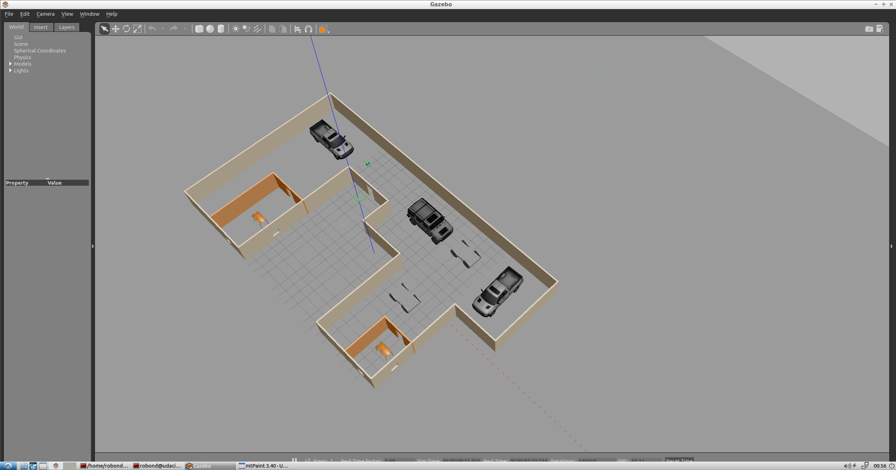

# Gazebo Project (Udacity Reviews)

## Build my World

The first Project was to discover Gazebo and design our own environment 

Main activities in this Project :

- Create our C++ plugin 
- Create a Gazebo World
- Design Building and Robot using Gazebo editor

## Go Chase It 

After creating my own environment, the main goal of this project was using most of ROS tools to make a ball chaser robot

Main activities :

  - Create a robot package gathering the robot, ball and world
  - Design a differential drive robot using URDF (2 wheels, lidar and Camera)
  - Implement robot's plugins
  - Create ball_chaser package holding C++ nodes (drive_bot and process_image)
  - Create a service which will control robot linear x and angular z velocities.
  - Launch file to launch world with the ball and robot and ball_chaser nodes
  
  
## Home service Robot (Final Project)

This project was a summary of all courses gathering **localization**, **mapping** and **path planning**. Instead of using turtlebot example as mentionned in the course,
I tried to re-used all I have done since I started. 

Thus I used my own world :

I needed to map again my world because some objects has been added. I uses ***map_server*** package and the test_slam.sh to map my world :

Test_slam.h was launching my gazebo world, ***slam_gmapping package*** and ***teleop_twist_keyboard*** package which was used to navigate in my gazebo world
and mapped at the same time. Map_server package was recording the map I was created and saved it.

To make my home service project, I reused my own launch file for the localization part. It used ***amcl*** ROS package and I try to play with
parameters related. 

Path planning was handled by **Dijkstra's** algo, a variant of the Uniform Cost Search algorithm, to plan our robot trajectory from start to goal position.

It was also required to create two others packages: ***add_markers and pick_objects***.

The first one created a marker in Rviz to simulate a virtual object and the second one was sending positions to achieve by the robot.

> This project aim was to simulate a robot going to a pickup zone and take object and drop it in the drop-off zone

##Demo

